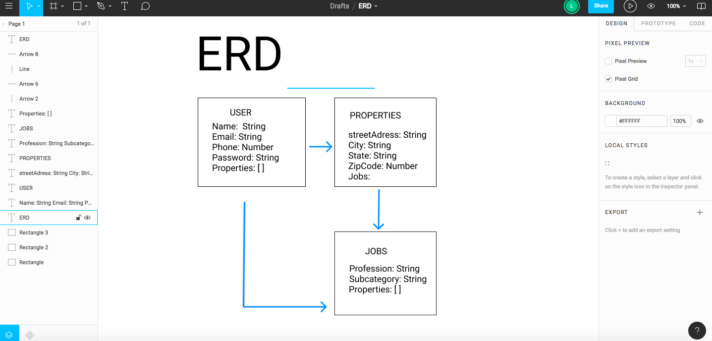
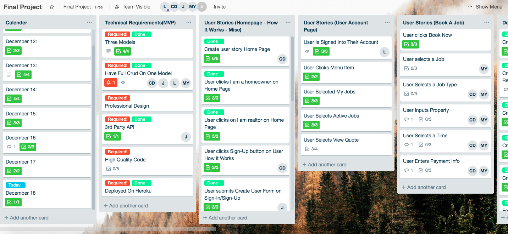

## Overview 

Jonny-On-It is an application that connects homeowners and realtors to service providers. How this differs from other service provider finder applications is that it is targeted at realtors and their clients who are just about to buy or sell a property and allows the realtors the ability to track and store Preferred Service Providers and suggest them to clients as they prepare the property for sale or implement repairs or upgrades for a new property owner.

## Team: 

### Jordan Dale, Loren Kelley , Myron Young and Chuck DeRosier

## Model ERD: 

## [Trello Board](https://trello.com/b/bp3VLOCm/final-project)

## [GitHub](https://github.com/Jdale28/jonny_collab)

## [Heroku App](https://jonny-on-it-collab.herokuapp.com)

## [Wireframes](https://idoc.mockplus.com/app/-x9wddoCF/specs/5qHLQmX-CA)

## Technologies:
### Front-end: 
- React
- React styled-components
- React-router-dom  
- Axios 
- Font-awesome 
- Material-ui 
- Bootstrap 
- Google-maps-react 
- React-accessible-accordian  
- React-calendar 
- React-geosuggest 
- React-strap
- React-semantic-ui-css
### Back-end: 
- Django
- Python
- Rest-frameworks
- Serializer

<!-- ## Version 2.0 
In version to  intergation of the stepper with the panels, have a continues callback function and implement reduxx -->

## Work Process

## November 13, 2018:

### The User Experience team which consisted of Ben Kessman, Chad Hansen, Elizabeth Kinsel, Loren Duxbury and the Web development team which consisted of Charles DeRosier, Jordan Dale, Loren Kelley, Myron Young met with the CEO/Sales Director, name, and Marketing Director, name, of Jonny On It.

## December 8, 2018:

### First Pre-planning session done on-line through Slack.
### First look at Models. Set up Trello board
### Jordan Dale set up Django - React boilerplate.

## December 11, 2018:

### Planning phase and backend setup:
### Jordan Dale: Created 4 Models, Serializers, Views, Urls, Fixtures.
### Loren Kelley: User Story and Dev To Do for User Account page. ERD.
### Myron Young: User Story and Dev To Do for Book A Job pages.
### Charles DeRosier: User Story and Developer To Do for Home Page, How It Works pages, and Misc pages. Start of defining naming conventions.

## December 12, 2018:

### Jordan Dale: Nav Bar, How It Works
### Loren Kelley: User Account: set up layout and styling
### Myron Young: Book Now- Added a stepper for components and mapped out all components for "Book-a-Job process"
### Charles DeRosier: Button Style component, Home Page Not Logged In

## December 13, 2018:

### Jordan Dale: How It Works, About Us
### Loren Kelley: User Account: styled My Jobs, Manage Properties 
### Myron Young: Book-A-Job and Job Type components
### Charles DeRosier: Home Page, Footer

## December 14, 2018(plusweekend):

### Jordan Dale: About Us, moved images to imgur
### Loren Kelley: User Account: Connecting backend to frontend to render users information (name)
### Myron Young: Book Now components integration Collapsible Panel 
### Charles DeRosier: Our Guarantee, User Terms, Provider Terms, Book Now JobType

## December 17, 2018:

### Jordan Dale: FAQ, update colors, authentication
### Loren Kelley: User Account:
### Myron Young: Refactoring components to pass state and props to all.
### Charles DeRosier: Book Property (styled/methods), Book Time (style/some methods), Book Payment (styled), Contact Us (placeholder)s

## December 18, 2018:

### Jordan Dale: authentication, google map api, react-geosuggest
### Loren Kelley: User Account: Styling, updating readme
### Myron Young: Book Now (connecting all the components, bringing down the data)
### Charles DeRosier: Book Time (add react-calendar, modify methods), Book Payment (methods, updated model), Blog
